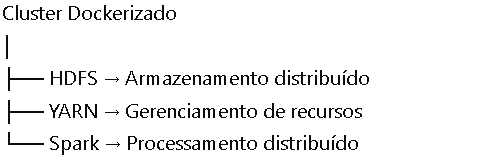
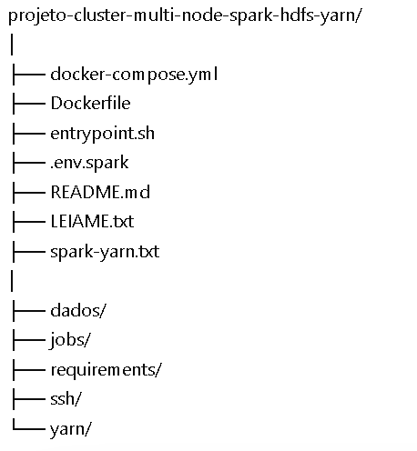

# 📊 Projeto: Cluster Multi-Node com Spark, HDFS e YARN

- Criação de um cluster Spark com HDFS e YARN multi-node.

- Criação de um pipeline de limpeza e transformação de dados usando PySpark SQL para treinar a avaliar modelos de Machine Learning no cluster Spark. 
Os dados serão carregados do ambiente distribuído com HDFS e o resultado do processamento será salvo em formato Parquet.
Os dados foram gerados com base no dataset disponível no link:https://www.kaggle.com/datasets/iamsouravbanerjee/airline-dataset/data.
Neste projeto vamos também explorar os conceitos de experimentação e execução no ambiente Spark.

## 📌 Visão Geral

Este projeto implementa um ambiente distribuído para processamento de dados utilizando tecnologias do ecossistema Big Data, como:

- Apache Spark → Processamento distribuído de dados  
- Hadoop HDFS → Armazenamento distribuído  
- Apache YARN → Gerenciamento de recursos do cluster  
- Docker → Containerização do ambiente  

O objetivo é simular um **cluster com múltiplos nós**, permitindo executar pipelines de dados de forma escalável, semelhante a ambientes reais de grandes empresas.

---

## 🎯 Problema que o projeto resolve

Empresas modernas lidam com grandes volumes de dados que não podem ser processados eficientemente em apenas uma máquina.

Além disso, no contexto da aviação, existe um desafio ainda mais crítico:

- Dificuldade em prever atrasos de voos  
- Impactos operacionais e financeiros causados por atrasos  
- Uso limitado de dados históricos para antecipar problemas  

Este projeto resolve esses problemas ao:

- Distribuir dados entre múltiplos nós (HDFS)
- Processar dados em paralelo (Spark)
- Gerenciar recursos do cluster (YARN)
- Padronizar o ambiente com containers (Docker)
- Aplicar técnicas de Machine Learning para **prever atrasos de voos**

💡 Em resumo:  
O projeto não apenas cria um ambiente Big Data distribuído, mas também utiliza esse ambiente para **analisar dados históricos e prever se um voo terá atraso**, apoiando decisões mais inteligentes e proativas.

---

## 🏗️ Arquitetura do Projeto




---

## 🧰 Tecnologias Utilizadas

- 🐳 Docker & Docker Compose  
- ⚡ Apache Spark  
- 🐘 Hadoop HDFS  
- 📦 Apache YARN  
- 🐍 Python  
- 📓 Jupyter Notebook  

---

## 📁 Estrutura do Projeto



---

## 📂 Explicação das Pastas e Arquivos

### ⚙️ Arquivos principais

#### 📄 `docker-compose.yml`
Responsável por orquestrar todo o ambiente.

Define:
- Serviços (containers)
- Rede entre os nós
- Papéis de cada componente (master, worker)

---

#### 📄 `Dockerfile`
Define como a imagem Docker é construída.

Inclui:
- Instalação do Spark
- Instalação do Hadoop
- Configuração do ambiente Python

---

#### 📄 `entrypoint.sh`
Script executado ao iniciar cada container.

Responsável por:
- Inicializar serviços do cluster
- Aplicar configurações automaticamente

---

#### 📄 `.env.spark`
Arquivo de variáveis de ambiente.

Define parâmetros como:
- Configurações do Spark
- Variáveis de execução do cluster

---

### 📊 Pasta `dados/`

Contém os datasets utilizados no projeto.

Exemplo:
- Arquivos CSV com dados de voos

👉 Esses dados são a base para o processamento distribuído.

---

### 🧠 Pasta `jobs/`

Contém os scripts responsáveis pelo processamento dos dados.

- Scripts Python com Spark
- Notebooks para exploração e análise

---

### 📦 Pasta `requirements/`

#### 📄 `requirements.txt`

Lista de dependências Python necessárias para execução do projeto.

---

### 🔐 Pasta `ssh/`

Contém configurações de SSH utilizadas para comunicação entre os nós do cluster.

---

### ⚙️ Pasta `yarn/`

Contém arquivos de configuração do Hadoop e YARN:

- core-site.xml  
- hdfs-site.xml  
- yarn-site.xml  
- mapred-site.xml  
- capacity-scheduler.xml  
- spark-defaults.conf  

👉 Esses arquivos controlam o funcionamento interno do cluster.

---

## 🚀 Como executar o projeto

### 1. Clonar o repositório

```bash
git clone <repo-url>
cd projeto-cluster-multi-node-spark-hdfs-yarn


2. Subir o cluster

docker compose -f docker-compose.yml up -d --scale spark-worker-yarn=3


# ✈️ Previsão de Voos com Apache Spark

## 📌 O que está sendo construído?

Os scripts Python deste projeto implementam um pipeline de dados com o objetivo de:

👉 **Analisar dados históricos de voos e gerar previsões**, como:
- Atrasos
- Padrões de comportamento
- Tendências operacionais

O processamento é realizado de forma distribuída utilizando o Apache Spark, permitindo lidar com grandes volumes de dados de forma eficiente e escalável.

---

## 🎯 Problema que está sendo resolvido

Companhias aéreas e aeroportos enfrentam desafios como:

- Atrasos frequentes
- Dificuldade em prever problemas operacionais
- Grande volume de dados históricos subutilizados

💡 Este projeto resolve esses problemas ao:

- Processar grandes datasets de voos
- Identificar padrões históricos
- Criar base analítica para **previsão de atrasos e comportamento de voos**

---

## 🔄 Pipeline de Dados

O fluxo de processamento segue as etapas abaixo:

Dados brutos → Limpeza → Transformação → Análise → Previsão


### 🧠 Explicação das etapas

#### 1. Leitura dos dados
- Carregamento de arquivos CSV contendo informações de voos
- Dados como horários, aeroportos, companhias e atrasos

#### 2. Tratamento dos dados
- Remoção de valores nulos
- Padronização de colunas
- Conversão de tipos (datas, números)

#### 3. Transformações
- Criação de novas variáveis (features)
  - Ex: tempo de atraso, dia da semana
- Agrupamentos e cálculos estatísticos
  - Ex: média de atraso por aeroporto

#### 4. Análise
- Identificação de padrões e tendências
- Comparações entre rotas, horários e companhias

#### 5. Previsão (base analítica)
- Uso de lógica baseada em dados históricos
- Preparação para modelos preditivos futuros

---

## 🧪 Script Principal: `projeto.py`

O script implementa um pipeline completo de **Machine Learning distribuído** utilizando PySpark para prever eventos relacionados a voos (como atrasos).

Ele realiza desde o treinamento até a avaliação e salvamento do modelo.

---

## 🎯 Objetivo do Script

Treinar um modelo de classificação capaz de:

👉 **Prever um evento binário** (ex: voo atrasado ou não)

Utilizando:
- Dados históricos de treino
- Validação cruzada
- Ajuste automático de hiperparâmetros

---

## ⚙️ Etapas do Processo

### 1. Inicialização do ambiente Spark

O script cria uma SparkSession, permitindo executar o processamento em ambiente distribuído.

---

### 2. Leitura dos dados

Os dados são carregados em formato Parquet:

- `dados_treino.parquet` → usado para treinar o modelo  
- `dados_teste.parquet` → usado para validar o desempenho  

👉 O formato Parquet é otimizado para Big Data.

---

### 3. Definição do modelo

É utilizado o algoritmo:

- **Regressão Logística (Logistic Regression)**

👉 Ideal para problemas de classificação binária.

---

### 4. Definição da métrica de avaliação

O modelo é avaliado usando:

- **AUC (Area Under ROC Curve)**

👉 Mede a capacidade do modelo de separar corretamente as classes.

---

### 5. Criação do Grid de Hiperparâmetros

O script testa automaticamente diferentes combinações de parâmetros:

- `regParam` → controla regularização  
- `elasticNetParam` → mistura entre L1 e L2  

👉 Isso permite encontrar a melhor configuração do modelo.

---

### 6. Validação Cruzada (Cross Validation)

É utilizado o CrossValidator do Spark para:

- Treinar múltiplos modelos
- Testar diferentes combinações de parâmetros
- Selecionar o melhor modelo automaticamente

---

### 7. Treinamento do modelo

O modelo é treinado usando os dados de treino:

```python
modelos = cv.fit(dados_treino)

## 📓 Notebooks

### 📘 `projeto-parte1.ipynb`
- Exploração inicial dos dados
- Entendimento das variáveis

### 📘 `projeto-parte2.ipynb`
- Análises mais avançadas
- Consolidação de métricas
- Base para modelagem preditiva

---

## ⚙️ Técnicas Utilizadas

- Processamento distribuído com Apache Spark
- Manipulação de dados com DataFrames
- Operações SQL
- Engenharia de atributos - Enriquecimento de dados
- Análise exploratória de dados
- Treinamento e Previsão de Modelos de Machine Learning

---

## 📈 Exemplos de Insights que podem ser gerados

- ✈️ Aeroportos com maior índice de atrasos  
- ⏰ Horários mais críticos  
- 📅 Dias da semana com maior volume de atrasos  
- 🛫 Relação entre distância do voo e atraso  

---

## 🧠 Explicação para não técnicos

Imagine que queremos responder à pergunta:

> “Quais voos têm maior chance de atrasar?”

O sistema analisa milhares (ou milhões) de voos passados e identifica padrões, como:

- Certos horários apresentam mais atrasos  
- Alguns aeroportos têm mais problemas operacionais  
- Determinadas rotas são mais críticas  

Com base nisso, é possível **antecipar comportamentos futuros**, ajudando na tomada de decisão.

---

## 🚀 Possíveis Evoluções

- Criar previsões em tempo real
- Integrar com APIs de dados de voos
- Desenvolver dashboards analíticos (Power BI, Superset)

---